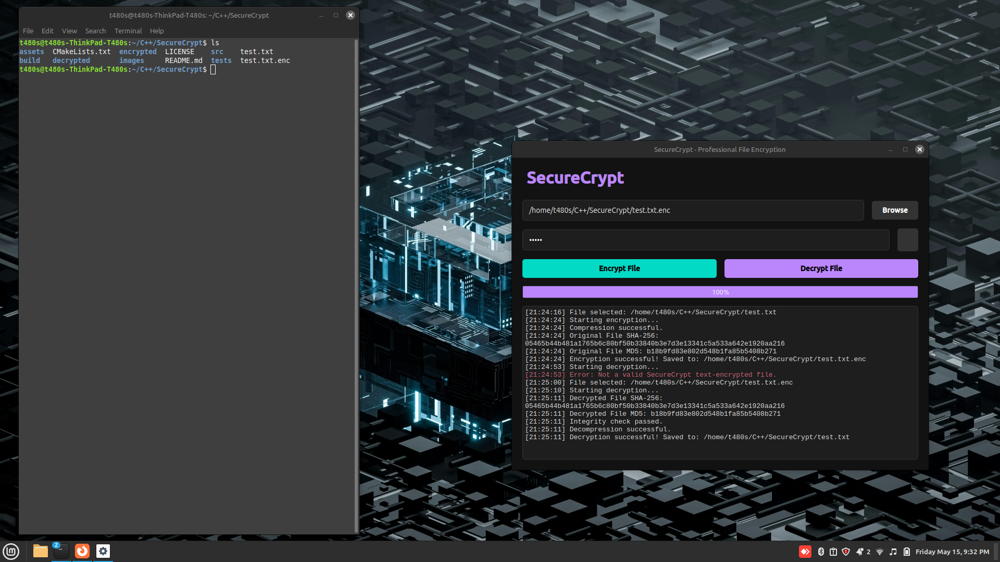

# SecureCrypt

SecureCrypt is a professional, modern desktop application for secure file encryption and decryption. Built with C++, Qt6, and OpenSSL, it provides robust AES-256 protection with a clean, dark-mode interface.

### User Interface
Below is a preview of the SecureCrypt application interface, demonstrating the primary encryption and decryption workspace:



## Features

*   **AES-256-CBC Encryption**: Industry-standard encryption for maximum security.
*   **PBKDF2 Key Derivation**: Securely generates keys from passwords with 100,000 iterations.
*   **SHA-256 Integrity Verification**: Ensures files haven't been tampered with or corrupted.
*   **Zlib Compression**: Automatic compression before encryption to save space.
*   **Modern Dark-Mode GUI**: A sleek, responsive interface with drag-and-drop support.
*   **Secure File Handling**: Binary-safe processing with secure overwrite protection.
*   **Modular Architecture**: Clean, scalable C++ code following SOLID principles.

## Getting Started

### Dependencies

*   CMake (3.16+)
*   Qt6 (Base, Tools)
*   OpenSSL (3.0+)
*   Zlib

### Installation (Ubuntu/Debian)

```bash
sudo apt-get update
sudo apt-get install -y qt6-base-dev qt6-tools-dev libssl-dev zlib1g-dev build-essential cmake
```

### Building the Project

```bash
mkdir build
cd build
cmake ..
make -j$(nproc)
```

### Running the Application

*   **GUI Version**: `./build/SecureCryptGUI`
*   **CLI Version**: `./build/SecureCrypt <encrypt|decrypt> <file> <password>`

## Architecture

*   `src/core`: Cryptographic engine using OpenSSL EVP API.
*   `src/gui`: Qt-based interface with custom styling and drag-and-drop.
*   `src/file`: Binary-safe file I/O and secure deletion.
*   `src/utils`: Compression and other helper utilities.

## Security Notes

*   Passwords are never stored in plaintext.
*   Salt and IV are randomly generated for every encryption operation.
*   SHA-256 checksums are embedded in encrypted files to verify integrity upon decryption.

## License

This project is licensed under the MIT License - see the [LICENSE](LICENSE) file for details.
